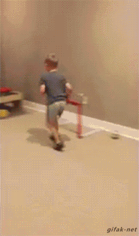

class: center, middle
.header[]

# Iroco

Bruno Thomas - [Iroco.co](https://iroco.co) - [@bthomas@mastodon.social](https://mastodon.social/@bthomas)
---
class: middle
.header[]

## Meeting of lawyers and dev

*Please could you make us an app*

* sort 150 to 200 mails/day into cases
* eco-designed
---
class: middle
.header[]

## An ecodesigned mail service

Lean approach : measure the runtime

3 axes ([ecoindex.fr](https://www.ecoindex.fr/)) :
- page complexity (number of DOM nodes) : weight 3
- number of HTTP requests : weight 2
- bandwidth use : weight 1

Focus on optimization and UX.

---
class: middle
.header[]

## Tools

- languages efficiency
- benchmarks
- profiling
- simplicity

[Lean conferences](https://lean4greenit.barreverte.fr), greenIT conferences

🍀&nbsp;🥳

---
class: middle
.header[]

## Hold by beer !

Knowledge growth, rationalization, Boavizta :

- GHG [scopes](https://boavizta.org/en/blog/empreinte-de-la-fabrication-d-un-serveur)
- multi-criteria mail & ICT Life Cycle Assessment

---
class: middle
.header[]

## Only few percents

80% of GHG is [scope 3](https://dataviz.boavizta.org/manufacturerdata) (devices)

 multi-criteria [LCA](https://www.sami.eco/blog/empreinte-carbone-email) :
* Global Warming Potential
* Primary Energy
* Abiotic Depletion Potential
* Water consumption
* ...

langage/code optimization: only few %

---
class: middle
.header[]

## Future actions

- Usage change, nudges (lowtech)
- slow down & sobriety
- backward compatibility (scope 3)
- build future ICT imaginary & stories
---
class: middle
.header[]

## References

* Energy efficiency across programming languages : https://dl.acm.org/doi/10.1145/3136014.3136031
* Digital & environment : How to evaluate server manufacturing footprint, beyond greenhouse gas emissions? : https://boavizta.org/en/blog/empreinte-de-la-fabrication-d-un-serveur
* Lean conferences slideshow https://lean4greenit.barreverte.fr
* Iroco benchmarks  (french) : https://blog.iroco.co/tags/#benchmark-ref
* mail LCA sami (french): https://www.sami.eco/blog/empreinte-carbone-email
